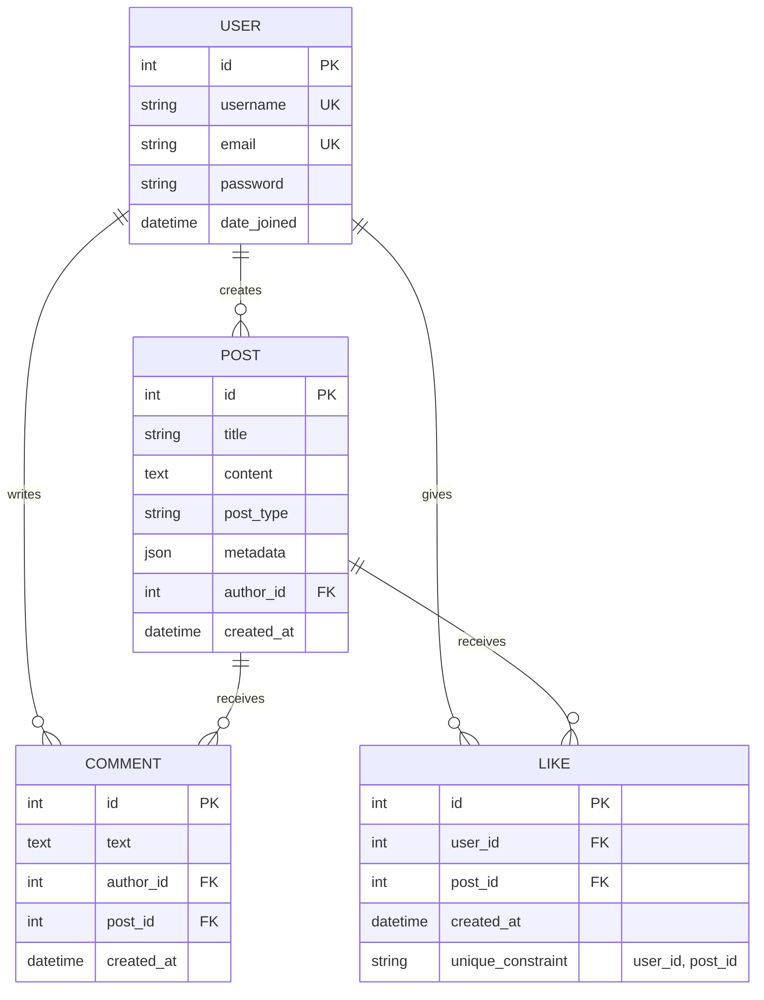
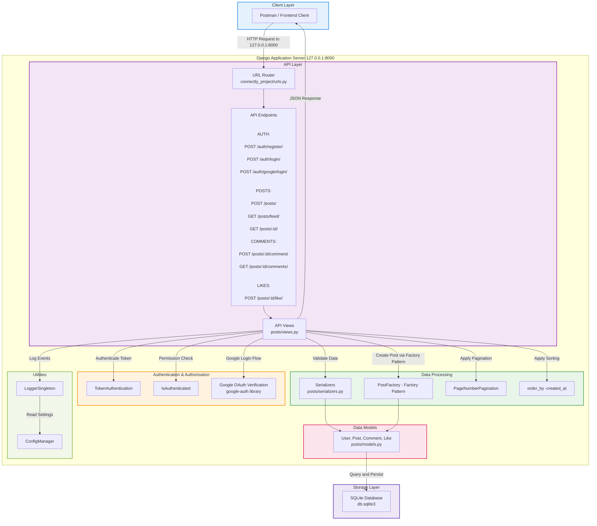
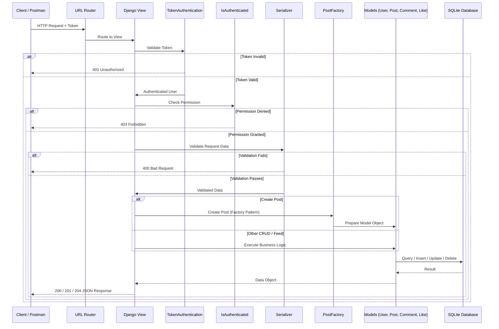
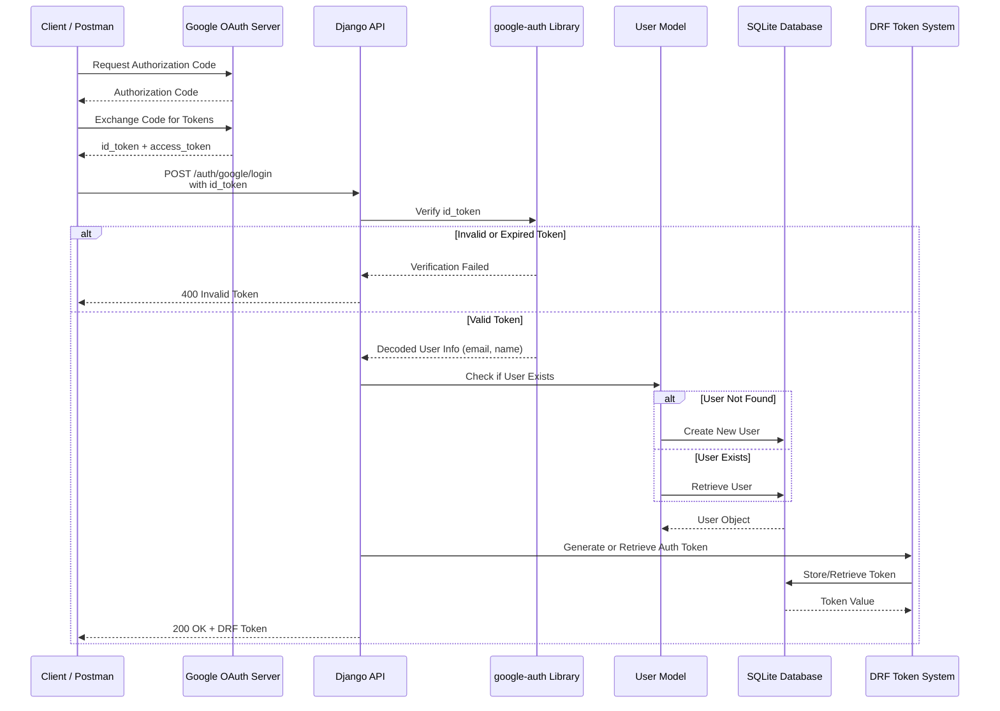

# Connectly REST API - Milestone 1 and Milestone 2 (Full Implementation)

This repository contains the complete implementation of Milestone 1 and Milestone 2 for the Connectly REST API. The project has been evolved from a basic CRUD setup to a secure, pattern-driven system designed for scalability and maintainability.

## Project Architecture
The project structure has been refactored into a "flattened" modular layout to improve accessibility and follow industry best practices:
* **`/factories`**: Standardized object creation using the Factory Pattern.
* **`/singletons`**: Centralized configuration and logging services.
* **`/posts`**: Main application logic for post and comment management.
* **`/connectly_project`**: Core Django settings and authentication configurations.


##  Key Features

### 1. Design Patterns
* **Factory Pattern**: Implemented `PostFactory` to handle logic for Text, Image, and Video posts. It enforces strict metadata validation (e.g., `file_size` for images and `duration` for videos).
* **Singleton Pattern**: Created `ConfigManager` for global API settings and `LoggerSingleton` for consistent system-wide event logging.

### 2. API Security & Authentication
* **Token-Based Authentication**: Secured endpoints using Django REST Framework's Token system.
* **Advanced Hashing**: Implemented Argon2 and PBKDF2 for robust password protection.
* **SSL/HTTPS**: Configured support for secure data transmission using SSL certificates (`cert.pem`, `key.pem`).

### 3. Core CRUD Functionality
* Robust endpoints for User registration, Authentication, and Post management.
* Detailed validation for all incoming JSON requests.

### 4. User Interactions (Like and Comment) 
### Like Functionality
Users can now like posts. Each user is only allowed to like a specific post once.  
The system prevents duplicate likes and returns proper error responses if:
- The post does not exist (404)
- The user already liked the post (400)

Endpoint:
POST /posts/{id}/like/

### Comment Functionality
Users can now add comments to posts and retrieve comments per post.  
Each comment is automatically linked to:
- The logged-in user
- The specific post (via URL parameter)

Endpoints:
POST /posts/{id}/comment/
GET /posts/{id}/comments/

Validation ensures:
- Comments cannot be added to non-existent posts
- Proper error handling is returned when needed

---

### Like & Comment Count
The post detail endpoint was updated to include:
- like_count
- comment_count

This allows clients to easily see how many likes and comments a post has.

---

### 5. Integrating Third-Party Services (Google OAuth Login)
Integrated Google OAuth to allow users to log in using their Google account.

Endpoint:
POST /auth/google/login/

The backend:
1. Verifies the Google ID token
2. Extracts the user email
3. Creates a user if not existing
4. Generates a DRF authentication token

Proper error handling is included for invalid or expired tokens.

### 6. News Feed 
The News Feed displays all posts created by users in the system. It shows the newest posts first and allows users to view content shared by others.

### Endpoint: GET /posts/feed/

This endpoint retrieves posts sorted by newest first and applies pagination.

Features:
- Requires Token Authentication
- Sorted by `created_at` (descending)
- Pagination enabled (default page size = 5)
- Handles invalid page requests gracefully

### Example Successful Response

```json
{
    "count": 4,
    "next": null,
    "previous": null,
    "results": [...]
}
```

### Example Error Response

```json
{
    "detail": "Invalid page."
}
```

### Postman Validation
The API has been fully verified using Postman with the following test suite:
1. **User Auth**: Register -> Login -> Token Retrieval.
2. **Factory Pass**: Successfully created Image/Video posts with correct metadata.
3. **Validation Fail**: Correctly caught `400 Bad Request` errors when required metadata fields were missing.

### Integrating Third-Party Services 
	•	Client secrets are not stored in the repository.
	•	Google OAuth credentials are managed securely in Google Cloud Console.
	•	Sensitive information is excluded from version control.

This project was developed collaboratively by the team.

AI tools (including ChatGPT) were used as a learning assistant to:
- Clarify OAuth integration steps


## Link For Design Patterns
<https://drive.google.com/drive/folders/17-shjiSjsrdfu2VWXNm7dRurJkm0SRZN?usp=sharing>


## Diagrams

## 1. Entity Relationship Diagram

### 1.1  Entity to API Endpoint Mapping
### USER
- POST /auth/register/
- POST /auth/login/
- POST /auth/google/login/

### POST
- POST /posts/
- GET /posts/feed/
- GET /posts/:id/
- DELETE /posts/:id/

### COMMENT
- POST /posts/:id/comment/
- GET /posts/:id/comments/

### LIKE
- POST /posts/:id/like/

## 2. CRUD Operations Flow

```mermaid
flowchart TD

    START[Client Sends HTTP Request] --> AUTH{Has Auth Token?}

    %% ================= AUTH =================

    AUTH -->|No| LOGIN["POST /auth/login/"]
    LOGIN --> VALID{Valid Credentials?}
    VALID -->|No| ERR401["401 Unauthorized"]
    VALID -->|Yes| TOKEN["Return DRF Token"]

    AUTH -->|Yes| ACTION
    TOKEN --> ACTION{Select API Endpoint}

    %% ================= CREATE POST =================

    ACTION --> CP["POST /posts/"]
    CP --> CPV[Validate post_type and metadata]
    CPV -->|Invalid| ERR400A["400 Bad Request"]
    CPV -->|Valid| FACTORY[PostFactory Creates Post]
    FACTORY --> SAVEPOST[Save Post to Database]
    SAVEPOST --> RES201["201 Created"]

    %% ================= GET SINGLE POST =================

    ACTION --> GP["GET /posts/{id}/"]
    GP --> GPC{Post Exists?}
    GPC -->|No| ERR404A["404 Not Found"]
    GPC -->|Yes| ADDCOUNT[Add like_count and comment_count]
    ADDCOUNT --> RES200A["200 OK Return Post JSON"]

    %% ================= LIKE POST =================

    ACTION --> LP["POST /posts/{id}/like/"]
    LP --> LPC{Post Exists?}
    LPC -->|No| ERR404B["404 Not Found"]
    LPC -->|Yes| DUP{Already Liked?}
    DUP -->|Yes| ERR400B["400 Already Liked"]
    DUP -->|No| SAVELIKE[Save Like]
    SAVELIKE --> RES201B["201 Created"]

    %% ================= COMMENT POST =================

    ACTION --> CM["POST /posts/{id}/comment/"]
    CM --> CMC{Post Exists?}
    CMC -->|No| ERR400C["400 Invalid Post"]
    CMC -->|Yes| VALIDC[Validate Comment Data]
    VALIDC -->|Invalid| ERR400D["400 Bad Request"]
    VALIDC -->|Valid| SAVECOM[Save Comment]
    SAVECOM --> RES201C["201 Created"]

    %% ================= GET COMMENTS =================

    ACTION --> GC["GET /posts/{id}/comments/"]
    GC --> RES200B["200 OK Return Comment List"]

    %% ================= FEED =================

    ACTION --> FEED["GET /posts/feed/"]
    FEED --> SORT[Order by -created_at]
    SORT --> PAGINATE[Apply PageNumberPagination]
    PAGINATE --> RES200C["200 OK Paginated Feed"]
```



## 3. System Architecture Diagram



## 4. API Request/Response Flow




## 5. Google OAuth Login Flow




## Setup Instructions

### 1. Clone the Repository
```
git clone <repository-url>
cd connectly_project
```

### 2. Create Virtual Environment
```
python -m venv env
env\Scripts\activate
```

Mac/Linux
```
python3 -m venv env
source env/bin/activate
```

### 3. Applying Migrations
```
python manage.py makemigrations
python manage.py migrate
```

### 4. Run Development Server
```
python manage.py runserver
```
### 5. Server URL
```
The development will run at: http://127.0.0.1:8000/
```
